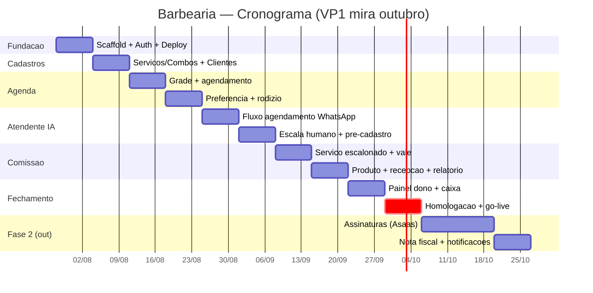

# Cronograma, Barbearia

Mira: **abertura da barbearia em outubro/2026**. Base: 2026-07-25 (~10 semanas até o go-live).

## Premissas
- Desenvolvimento com Claude Code (spec-driven nos módulos duráveis), 1 dev conduzindo + subagentes.
- Dedicação aproximada de tempo integral. Se for meio período, o cronograma estica proporcionalmente.
- Prioridade do cliente: **atendimento IA + comissão** (Fase 1). Assinaturas logo após abrir. Estoque/metas/TV depois.
- NFS-e depende da prefeitura/regime (MEI → Simples); pode escorregar pra Fase 2 sem travar a abertura.

## Marcos (milestones)
| Marco | Quando | Entrega |
|---|---|---|
| **M1** | fim S1 (03/08) | Ambiente no ar: login (Logto) + deploy front/back |
| **M2** | fim S4 (24/08) | Agenda funcionando (grade + preferência + rodízio) |
| **M3** | fim S6 (07/09) | Atendente IA agendando pelo WhatsApp |
| **M4** | fim S8 (21/09) | Comissão calculando (serviço + produto + vale) |
| **M5** | fim S10 (05/10) | **VP1 completo, go-live / abertura** |
| **M6** | out (S11-S13) | Assinaturas no ar (VP2) |

## Cronograma semanal (Fase 1, VP1)
| Semana | Datas | Foco |
|---|---|---|
| S1 | 28/07-03/08 | Spec Kit `constitution`; scaffold Next.js + Fastify + Supabase; **auth Logto** (RBAC dono/recepção/barbeiro); pipeline de deploy (Vercel + Coolify) |
| S2 | 04/08-10/08 | Cadastros base: **serviços/combos** (catálogo, duração editável por serviço/barbeiro), profissionais, clientes; spec da Agenda |
| S3 | 11/08-17/08 | **Agenda** parte 1: grade por profissional, criar/editar agendamento, horários de funcionamento, bloqueios |
| S4 | 18/08-24/08 | **Agenda** parte 2: preferência de barbeiro + **rodízio** dos sem preferência; início do Atendente IA |
| S5 | 25/08-31/08 | **Atendente IA (WhatsApp)**: integração SimplesZap, fluxo de agendamento, lógica de horário (1-2 antes/depois; horário menos ocupado) |
| S6 | 01/09-07/09 | Atendente IA: descrição de serviços, **escala pra humano**, pré-cadastro (nome/telefone); testes de ponta a ponta |
| S7 | 08/09-14/09 | **Comissão** parte 1: escalonada mensal por faixa de faturamento (serviço); vale com 30% desconto |
| S8 | 15/09-21/09 | **Comissão** parte 2: produto (5/7/10%), recepcionista (+ R$10/hidratação de cabelo), relatórios por profissional |
| S9 | 22/09-28/09 | **Painel do dono** (faturamento total e por profissional, metas) + **caixa/fechamento de conta** (recepção: lançar serviço/produto, fechar conta) |
| S10 | 29/09-05/10 | Homologação com o cliente, ajustes finais, treinamento da equipe, **go-live** |

## Fase 2 (VP2) — outubro
| Semana | Foco |
|---|---|
| S11-S12 | **Assinaturas**: planos Flex/Premium, **Asaas cartão recorrente** (PIX de reserva), fila de espera com aprovação por painel, **pote por pontos** (60% barbearia / 40% pote) |
| S13 | **Nota fiscal** (MEI → Simples), envio por WhatsApp; notificações ao dono (canal "chefe") |

## Fase 3 (VP3) — novembro em diante
Estoque com contagem diária + alerta de consumo, metas/premiação, indicadores de churn, mídia indoor na TV.

## Gantt

## Riscos / dependências
- **Prazo apertado:** 10 semanas pra VP1 é factível com IA, mas sem folga. Mitigação: paralelizar módulos independentes com subagentes; cortar escopo do painel pra o mínimo no go-live.
- **Atendente IA** é o item de maior incerteza (integração + regras de horário). Tem 2 semanas reservadas; se estourar, entra no ar em modo assistido (recepção confirma) e evolui.
- **NFS-e** varia por prefeitura; se a integração fiscal atrasar, abre sem NF automática (emite manual) e entra na Fase 2.
- **Assinaturas** só começam a valer com a barbearia aberta, então podem ir logo após o go-live sem prejuízo.

> Próximo doc: `ORCAMENTO.md` (custo por parte: setup + mensalidade de infra/WhatsApp/IA/gateway).
